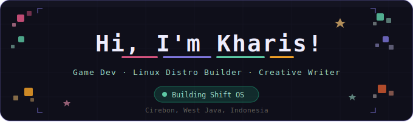

<div align="center">



[](https://github.com/Kharisdestianmaulana-hub)
[](https://github.com/Kharisdestianmaulana-hub?tab=followers)
[](https://github.com/Kharisdestianmaulana-hub)

</div>

---

## About

```
Kharis Destian — IT Student · Indie Dev · Linux Enthusiast
Location  : Cirebon, West Java, Indonesia
University: Universitas Catur Insan Cendikia (UCIC)
```

I bridge technical logic and creative work — building games, shipping a custom Linux distro, and writing long-form fiction. If it can be customized, it will be.

---

## Active Projects

| Project | Type | Status |
| :--- | :--- | :--- |
| [Shift OS](https://github.com/Kharisdestianmaulana-hub/Shift-OS) · [website](https://shiftos.vercel.app/) | Linux Distro | Active |
| Pocket Officer | 3D Platformer (Godot) | In Development |
| GDScript Comment Remover | Godot Plugin | Published |

---

## Tech Stack

**Languages**


**Tools**


---

## GitHub Stats

<div align="center">


[](https://github.com/Kharisdestianmaulana-hub)

</div>

---

## Wakatime

<div align="center">

[](https://wakatime.com/@RiRay)

</div>

---

## Contribution Graph

<div align="center">


</div>

---

## Currently Listening

<div align="center">

[](https://spotify-github-profile.kittinanx.com/api/view?uid=31um45nuady5jjjnbeh7fhfn3zui&redirect=true)

</div>

---

## Roadmap

| Timeline | Goal | Status |
| :--- | :--- | :--- |
| Q1 2026 | Ship Shift OS v26.03.1 publicly | Done |
| Q2 2026 | Launch Shift OS website & community | Active |
| Q3 2026 | Release Pocket Officer demo | In Progress |
| Q3 2026 | Shift OS v26.09 "Serenity" | Planned |
| Q4 2026 | Finish novel first draft | Planned |
| 2027 | Graduate from UCIC | Planned |
| 2027 | Shift OS ARM support + App Center | Planned |
| 2027+ | Ship a commercial game | Long-term |

---

## Setup

```yaml
OS      : macOS Monterey + Ubuntu Budgie
Editor  : Visual Studio Code, Antigravity
Shell   : Bash
Distro  : Shift OS (Ubuntu 24.04 LTS base)
Tools   : Godot Engine 4 · Cubic · Adobe Illustrator
```

---

## Contact

[](mailto:maulanakharis123@gmail.com)
[](https://instagram.com/kharis_destian)
[](https://tiktok.com/@riray0412)
[](https://shiftos.vercel.app)

---

## Support

[](https://saweria.co/RiRay)
[](https://ko-fi.com/riray)

---

<div align="center">

_"Building logic through code, crafting worlds through stories."_


</div>
